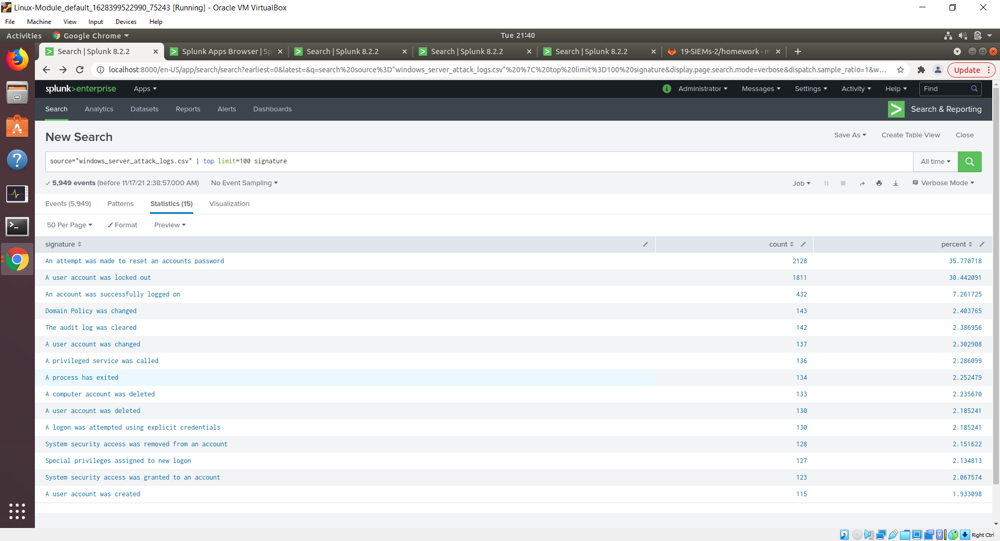
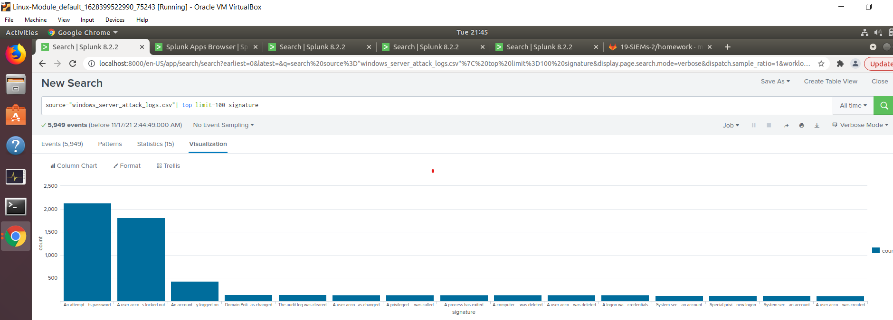

## Unit 19 Homework: Protecting VSI from Future Attacks

### Scenario

In the previous class,  you set up your SOC and monitored attacks from JobeCorp. Now, you will need to design mitigation strategies to protect VSI from future attacks. 

You are tasked with using your findings from the Master of SOC activity to answer questions about mitigation strategies.

### System Requirements 

You will be using the Splunk app located in the Ubuntu VM.

### Logs

Use the same log files you used during the Master of SOC activity:

- [Windows Logs](resources/windows_server_logs.csv)
- [Windows Attack Logs](resources/windows_server_attack_logs.csv)
- [Apache Webserver Logs](resources/apache_logs.txt	)
- [Apache Webserver Attack Logs](resources/apache_attack_logs.txt	)

---

### Part 1: Windows Server Attack

Note: This is a public-facing windows server that VSI employees access.
 
#### Question 1
- Several users were impacted during the attack on March 25th.
- Based on the attack signatures, what mitigations would you recommend to protect each user account? Provide global mitigations that the whole company can use and individual mitigations that are specific to each user.
  
        Global solution
        Server update
        User password :15 minimum caracters (letter, symbol and number) and no reuse
        change password after 90 days
        lock account after 3 attemps

        User K
        attenpt was made to reset password 
        impossible to gain acces the bad guy tried to reset.

        User  a
        the account was locked
        The bad guy failed to this acount may be because of the caracter

        user j
        this account was successfully logged on
        it means  the bad guy found the user password

#### Question 2
- VSI has insider information that JobeCorp attempted to target users by sending "Bad Logins" to lock out every user.
- What sort of mitigation could you use to protect against this?
  

          Set a group policy
          Lock account after specific time
        Iin case of attack company and employer it team should be notify

### Part 2: Apache Webserver Attack:

#### Question 1
- Based on the geographic map, recommend a firewall rule that the networking team should implement.
- Provide a "plain english" description of the rule.
  - For example: "Block all incoming HTTP traffic where the source IP comes from the city of Los Angeles."
- Provide a screen shot of the geographic map that justifies why you created this rule. 
  

        Most of the incoming attacks were coming from Ukraine, therefore we should set up a firewall rule to block HTTP traffic from Ukraine.
        Firewall Rule Description - "Block all incoming HTTP traffic where the source IP comes from the country of Ukraine"
#### Question 2

- VSI has insider information that JobeCorp will launch the same webserver attack but use a different IP each time in order to avoid being stopped by the rule you just created.

- What other rules can you create to protect VSI from attacks against your webserver?
  - Conceive of two more rules in "plain english". 
  - Hint: Look for other fields that indicate the attacker.
  
         You can create two others rules based off of 'user_agent' and 'bytes'. The recurring user agent is "Mozilla/4.0 (compatible; MSIE 6.0; Windows NT 5.2; SV1; .NET CLR 2.0.50727987787; InfoPath.1)." and the recurring byte amount is 65748.

        Both rule descriptions would be as follows:
        "Block all incoming HTTP traffic where the useragent is "Mozilla/4.0 (compatible; MSIE 6.0; Windows NT 5.2; SV1; .NET CLR 2.0.50727987787; InfoPath.1)."
        "Block all incoming HTTP traffic where the bytes amount is 65748."

### Guidelines for your Submission:
  
In a word document, provide the following:
- Answers for all questions.
- Screenshots where indicated

Submit your findings in BootCampSpot!

---

© 2020 Trilogy Education Services, a 2U, Inc. brand. All Rights Reserved.
