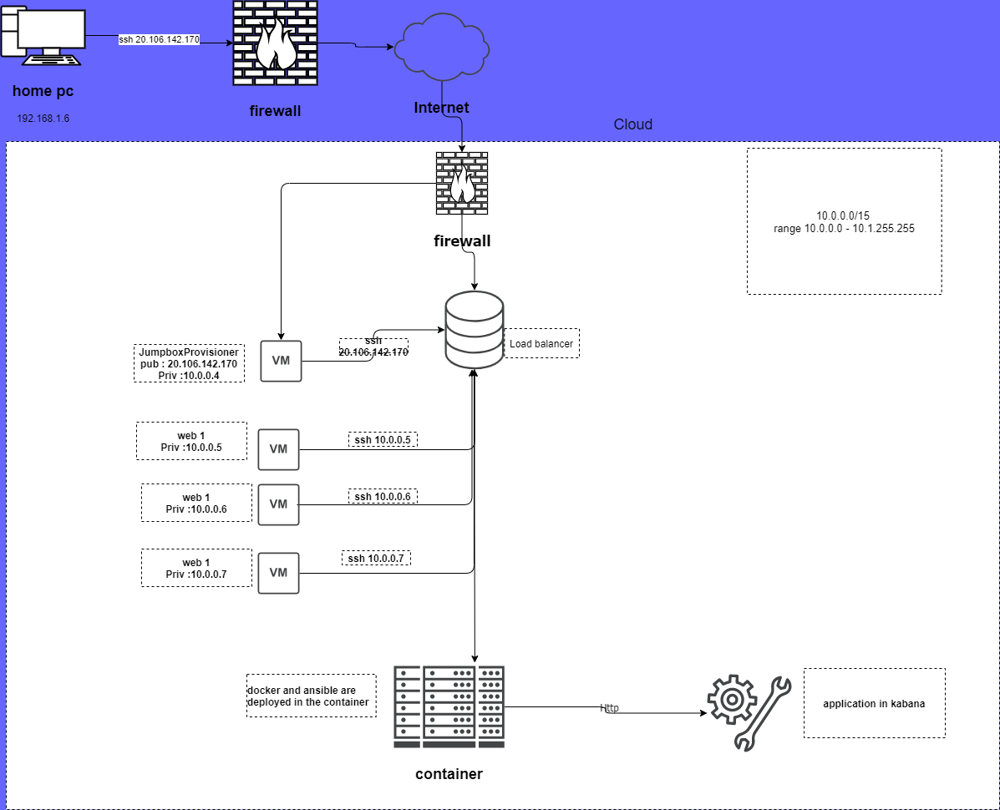
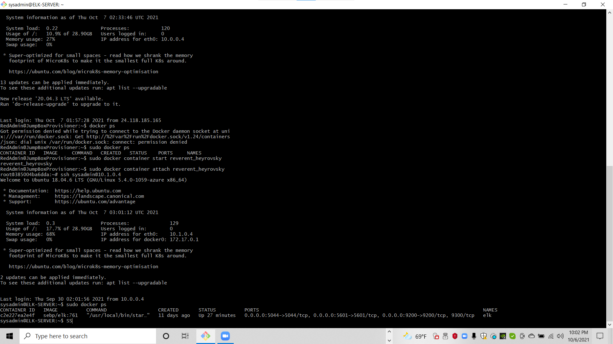
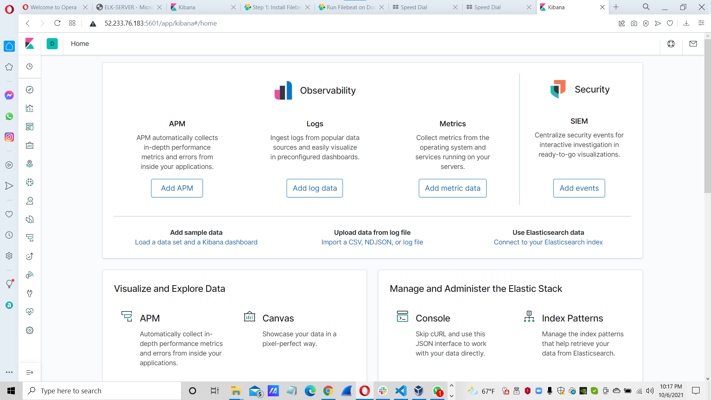
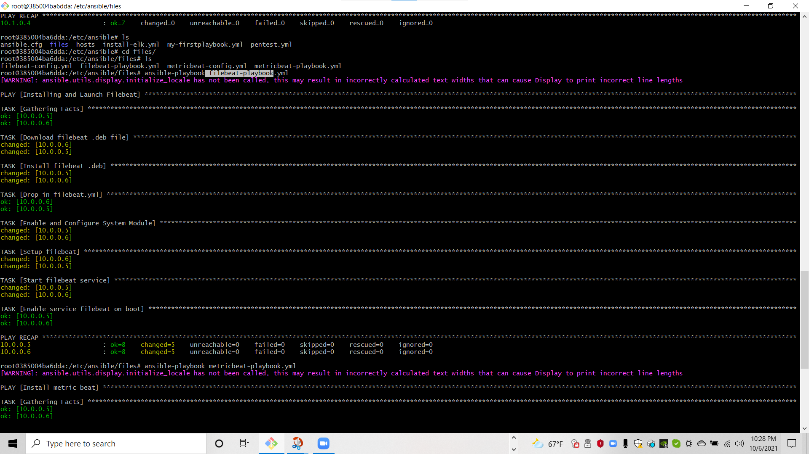
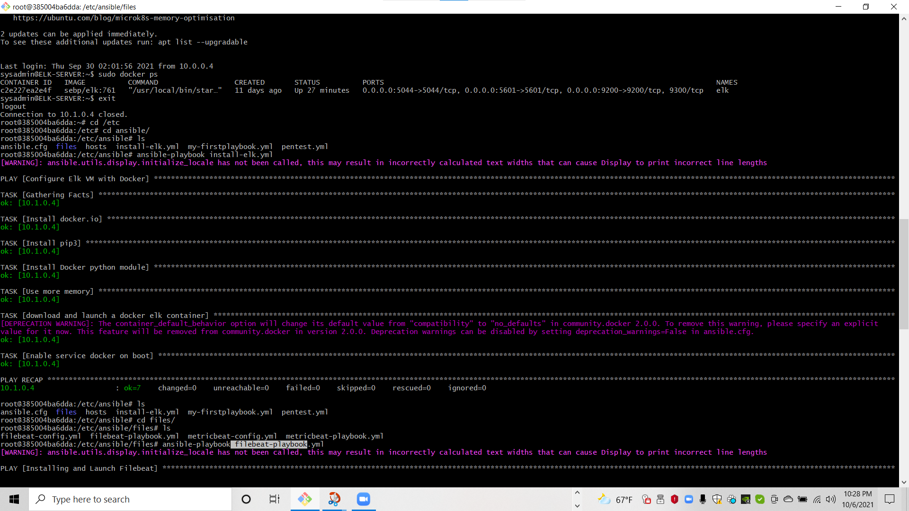
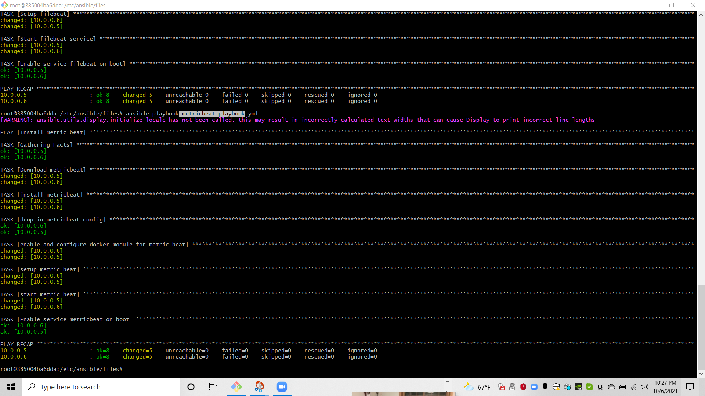

## Automated ELK Stack Deployment

The files in this repository were used to configure the network depicted below.

These files have been tested and used to generate a live ELK deployment on Azure. They can be used to either recreate the entire deployment pictured above. Alternatively, select portions of the .yml file may be used to install only certain pieces of it, such as Filebeat.

  Enter the playbook file._

  [filebeat-configuration.yml](filebeat-configuration.yml)

 [filebeat-playbook.yml](filebeat-playbook.yml)

 [metricbeat-configuration.yml](metricbeat-configuration.yml)

 [metricbeat-playbook.yml](metricbeat-playbook.yml)

 [install-elk.yml](install-elk.yml)

This document contains the following details:
- Description of the Topology
- Access Policies
- ELK Configuration
  - Beats in Use
  - Machines Being Monitored
- How to Use the Ansible Build

### Description of the Topology

The main purpose of this network is to expose a load-balanced and monitored instance of DVWA, the D*mn Vulnerable Web Application.

Load balancing ensures that the application will be highly accessible, in addition to restricting inbound traffic to the network.
-  What aspect of security do load balancers protect? What is the advantage of a jump box?_
Load balancers protect against DDoS attacks by shifting the attack traffic and dispersing it elsewhere.
The advantage of a jump box is that you are able to access and manage devices (through the jump box) in a separate security zone.

Integrating an ELK server allows users to easily monitor the vulnerable VMs for changes to the data and system logs.
-What does Filebeat watch for?_
Filebeat is a lightweight shipper for forwarding and centralizing log data
- What does Metricbeat record?
Metricbeat is a lightweight shipper that records and periodically collects metrics from the operating system and from services running on the server and takes the metrics and statistics that it collects and ships them to the output that users specify, such as Elasticsearch or Logstash

The configuration details of each machine may be found below.
_Note: Use the [Markdown Table Generator](http://www.tablesgenerator.com/markdown_tables) to add/remove values from the table_.

| Name     | Function | IP Address | Operating System |
|----------|----------|------------|------------------|
| Jump Box | Gateway  | 10.0.0.4   | Linux            |
|elk server|monitor   | 10.1.0.4   |  Linux           |
| web-1    | server   |  10.0.0.5  |  Linux           |
| web-2    |server    |  10.0.0.6  |  Linux           |

### Access Policies

The machines on the internal network are not exposed to the public Internet. 

Only the Jump Box machine can accept connections from the Internet. Access to this machine is only allowed from the following IP addresses:
-20.106.142.170

Machines within the network can only be accessed by ssh.
- Which machine did you allow to access your ELK VM? What was its IP address?
web-1 and web-2

A summary of the access policies in place can be found in the table below.

| Name     | Publicly Accessible | Allowed IP Addresses     |
|----------|---------------------|----------------------    |
| Jump Box | Yes/                | 10.0.0.0/16 - 10.0.0.0/16|
| elk server| no                  | 10.1.0.4                 |
| web-1     | no                  | 10.0.0.0/16 - 10.1.0.0/16|
| web-2     | no                  | 10.0.0.0/16 - 10.1.0.0/16|

### Elk Configuration

Ansible was used to automate configuration of the ELK machine. No configuration was performed manually, which is advantageous because...
-What is the main advantage of automating configuration with Ansible?_

    Ansible automates and simplifies repetitive, complex, and tedious operations. Everybody likes it because it brings huge time savings when we install packages or configure large numbers of servers. Its architecture is simple and effective. It works by connecting to your nodes and pushing small programs to them

The playbook implements the following tasks:
- In 3-5 bullets, explain the steps of the ELK installation playbook. E.g., install Docker; download image; etc._

      -Install docker .io, install pip3 python3, docker python module

The following screenshot displays the result of running `docker ps` after successfully configuring the ELK instance.

### Target Machines & Beats
This ELK server is configured to monitor the following machines:
-  List the IP addresses of the machines you are monitoring_

        web-1 (10.0.0.5) and web-2 (10.0.0.6)

We have installed the following Beats on these machines:
- Specify which Beats you successfully installed_

      metricbeat and filebeat

These Beats allow us to collect the following information from each machine:
- In 1-2 sentences, explain what kind of data each beat collects, and provide 1 example of what you expect to see. E.g., `Winlogbeat` collects Windows logs, which we use to track user logon events, etc._

      Filebeat is a lightweight shipper for forwarding and centralizing log data. Installed as an agent on your servers, Filebeat monitors the log files or locations that you specify, collects log events, and forwards them either to Elasticsearch or Logstash for indexing 

### Using the Playbook
In order to use the playbook, you will need to have an Ansible control node already configured. Assuming you have such a control node provisioned: 

### These are the command I use to run ansible-playbooks.

      cd /etc/ansible/files then run theses below
        ansible-playbook install-elk.yml
        ansible-playbook filebeat-playbook.yml and ansible-playbook metricbeat-playbook.yml
        http://52.233.76.183:5601/app/kibana

