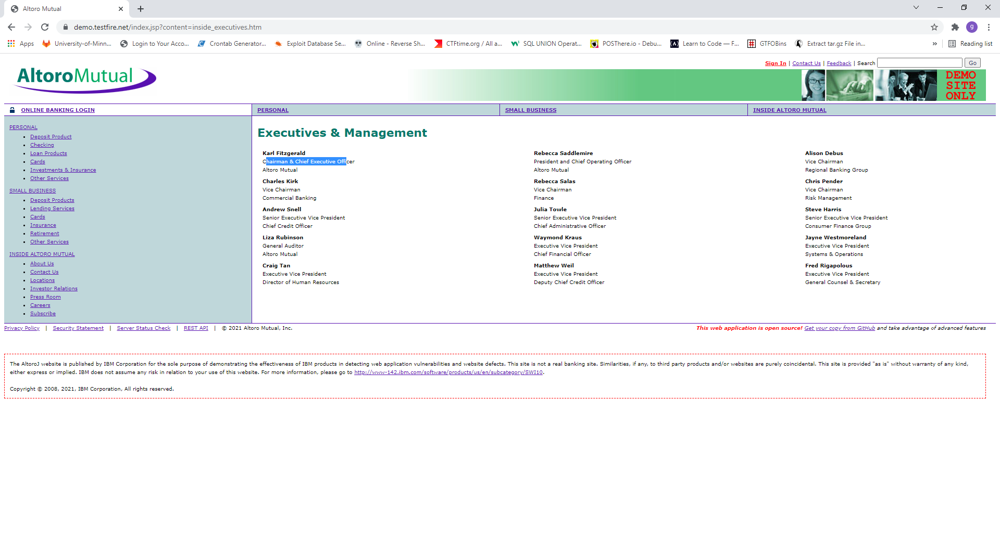
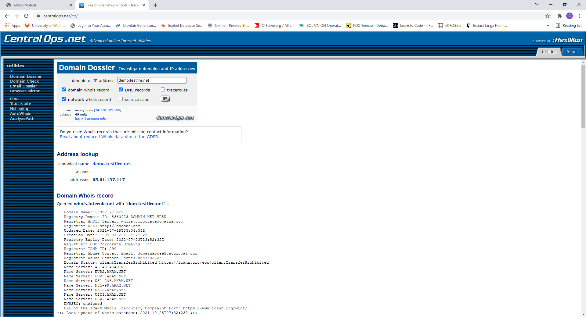
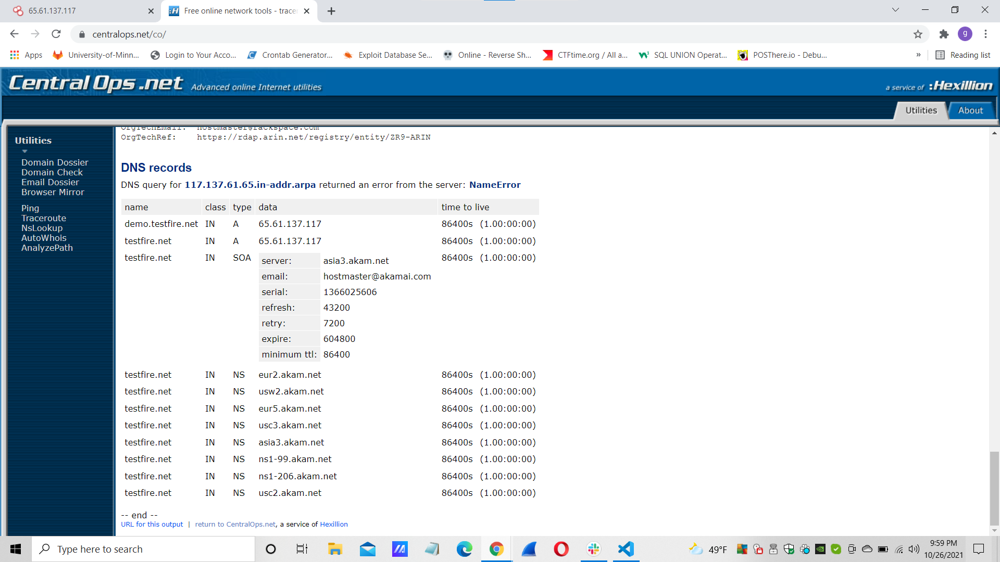
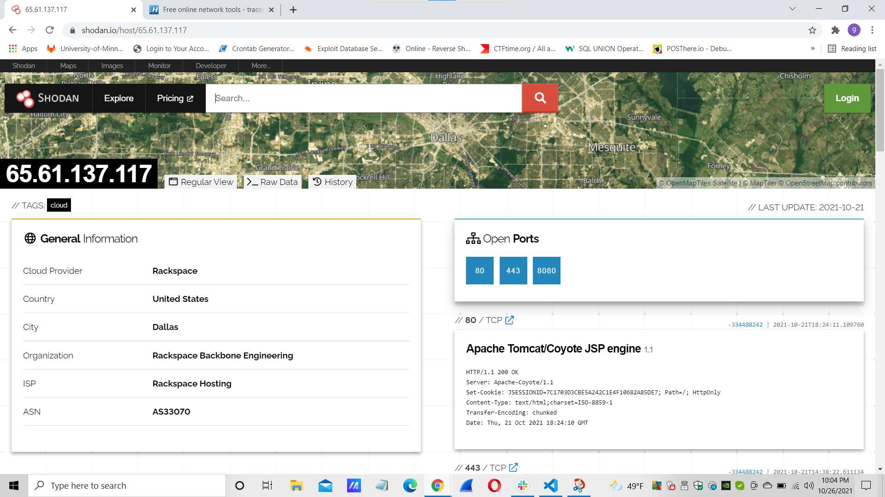
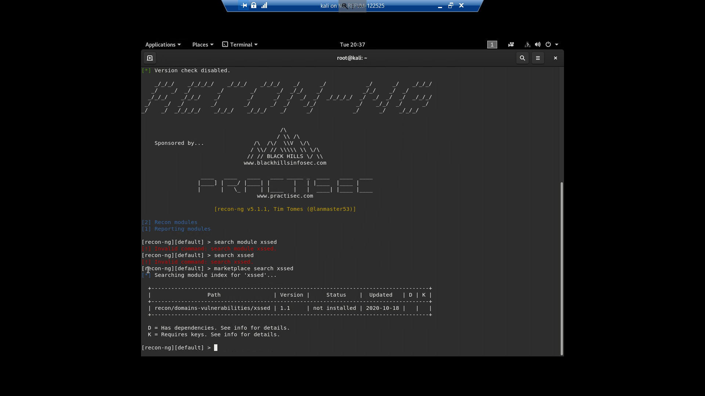
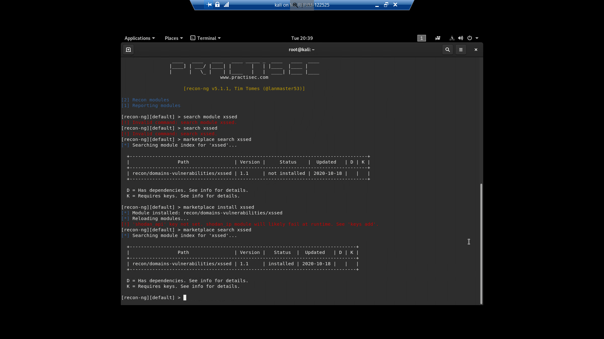
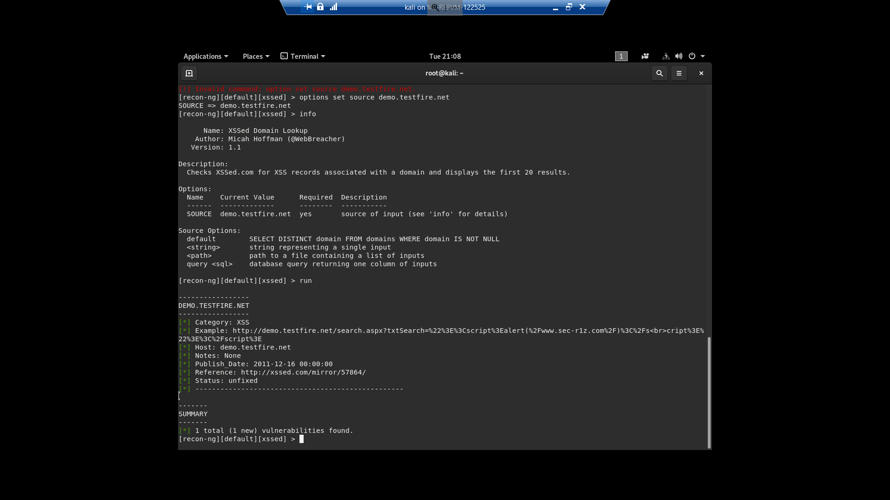
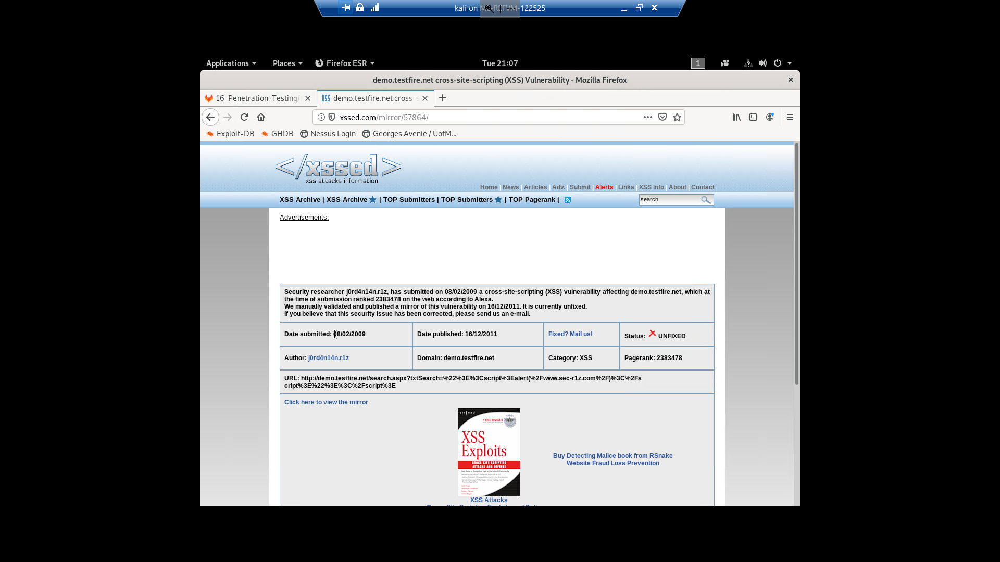
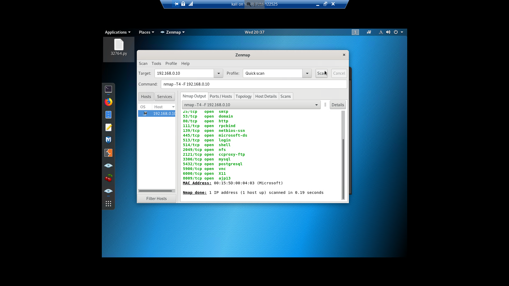

## Week 16 Homework Submission File: Penetration Testing 1

#### Step 1: Google Dorking

- Using Google, can you identify who the Chief Executive Officer of Altoro Mutual is:

- How can this information be helpful to an attacker:

 

#### Step 2: DNS and Domain Discovery

Enter the IP address for `demo.testfire.net` into Domain Dossier and answer the following questions based on the results:

  1. Where is the company located: 

    Admin City: Sunnyvale
    Admin State/Province: CA
    Admin Postal Code: 94085
    Admin Country: US
    Admin Phone: +Not Disclosed
    Admin Phone Ext: 
    Admin Fax: +Not Disclosed

  2. What is the NetRange IP address:

          65.61.137.64 - 65.61.137.127

  3. What is the company they use to store their infrastructure:

    custName:       Rackspace Backbone Engineering
          Address:        9725 Datapoint Drive, Suite 100
          City:           San Antonio
          StateProv:      TX
          PostalCode:     78229
          Country:        US
          RegDate:        2015-06-08
          Updated:        2015-06-08
          Ref:            https://rdap.arin.net/registry/entity/C05762718

  4. What is the IP address of the DNS server:

    65.61.137.117

  

#### Step 3: Shodan

- What open ports and running services did Shodan find:

https://www.shodan.io/host/65.61.137.117

80 , 443 and 8080

 

#### Step 4: Recon-ng

- Install the Recon module `xssed`. 
- Set the source to `demo.testfire.net`. 
- Run the module. 

      recon-ng
      marketplace search xssed
      marcketplace install xssed
      modules load recon/domains-vulnerableilities/xssed
      options set SOURCE demo.testfire.net
      info
      run

Is Altoro Mutual vulnerable to XSS: 

    yes

### Step 5: Zenmap

Your client has asked that you help identify any vulnerabilities with their file-sharing server. Using the Metasploitable machine to act as your client's server, complete the following:

- Command for Zenmap to run a service scan against the Metasploitable machine: 

 

- Bonus command to output results into a new text file named `zenmapscan.txt`:

- Zenmap vulnerability script command: 

- Once you have identified this vulnerability, answer the following questions for your client:
  1. What is the vulnerability:

  2. Why is it dangerous:

  3. What mitigation strategies can you recommendations for the client to protect their server:

---
© 2020 Trilogy Education Services, a 2U, Inc. brand. All Rights Reserved.  

